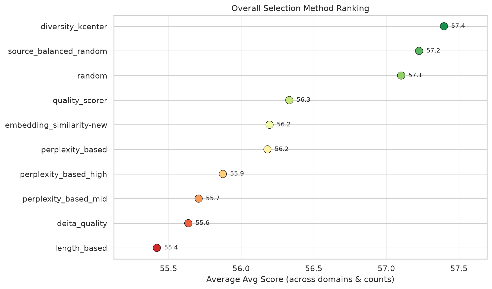

<p align="center">
  <a href="https://datapreparationbench.github.io/">
    
  </a>
</p>

<h1 align="center">Data Preparation Bench</h1>

<p align="center">
  <a href="https://datapreparationbench.github.io/">
    
  </a>
  <a href="https://github.com/haolpku/Data-Preparation-Bench">
    
  </a>
  <a href="https://huggingface.co/datasets/lhpku20010120/Data-Prep-Bench">
    
  </a>
  <a href="https://www.python.org/">
    
  </a>
  <a href="LICENSE">
    
  </a>
  <a href="https://datapreparationbench.github.io/assets/DataPrep-Bench.pdf">
    
  </a>
</p>

<p align="center"><strong>A unified, downstream-grounded benchmark for data preparation in LLM training pipelines.</strong></p>

---

## 👋 Overview

DataPrep-Bench is the first unified, downstream-grounded benchmark that jointly evaluates how well LLMs, agents, and data workflows can prepare training data end to end. It covers three complementary tracks:

- **Data Construction** — transforms raw sources into SFT data.
- **Data Selection** — selects high-utility subsets from candidate pools.
- **Data Quality Evaluation** — predicts the downstream utility of candidate datasets.

It also ships strong baselines for each track: Data-Construction-Skill for skill-driven agentic construction, a unified Data-Selection framework with ten selector strategies, and the Distributional Alignment Score (DAS), a training-free, MMD-based quality estimator. All tracks are tested under shared domains, base models, training protocols, and downstream benchmarks, so methods are compared by their actual downstream impact.

## 🏗️ Data Construction

### Data Construction

The Data Construction module [md_to_qa](./md_to_qa) converts Markdown books and long-form documents into structured supervision datasets for LLM fine-tuning. It targets book-to-SFT workflows where full content coverage, resumable execution, and quality control are required.

#### Dataset Outputs

The pipeline compiles source knowledge into three complementary supervision forms:

- **Concept QA** — Atomic, reusable knowledge such as definitions, categories, rules, mechanisms, purposes, and constraints.
- **Process QA** — Concise, grounded reasoning patterns including condition checking, rule application, causal explanation, comparison, exception handling, and step ordering.
- **Case Application** — Knowledge transfer into realistic, source-grounded scenarios where the model must analyze a situation and apply domain knowledge.

#### Pipeline Overview

1. **Corpus Preparation** — Build a manifest from a directory of Markdown files and split long documents into overlapping chunks.
2. **Knowledge Cleaning** — Clean and normalize chunks to remove boilerplate and improve semantic coherence.
3. **QA Generation** — Generate the three supervision forms above from each chunk via LLM-based operators.
4. **Scoring & Filtering** — Score generated QA pairs and filter out low-quality items.
5. **Validation & Coverage Audit** — Ensure every chunk reaches a final state (`kept` or `skipped`) and report coverage statistics.

The pipeline is resumable and tracks progress via `chunk_status.jsonl`, making it suitable for long-running batch jobs.

#### Implementation Layout

| Path | Description |
|------|-------------|
| `md_to_qa/DataFlow/` | Core pipeline implementations, including chunking, cleaning, generation, scoring, and filtering operators. |
| `md_to_qa/LLM/` | Batch and domain processing scripts for large-scale data generation. |
| `md_to_qa/SKILL/` | Skill definitions, reference materials, and helper scripts for Markdown-to-QA conversion. |
| `md_to_qa/Agent/` | Agent prompts and task specifications for automated dataset construction. |

#### Data Construction Skill

The underlying data-construction skill is also published as a standalone, reusable skill:

- **Skill:** [data_construction_skill](https://clawhub.ai/technomad-ds/data-construction-skill)

You can reference or import this skill directly in compatible agent frameworks.

### Training

Training is conducted using [LlamaFactory](https://github.com/hiyouga/LlamaFactory). Base models include:
- [Qwen2.5-7B](https://huggingface.co/Qwen/Qwen2.5-7B)
- [Llama-3.1-8B](https://huggingface.co/meta-llama/Llama-3.1-8B)

For each constructed dataset, we will use it to train both base models followed by a [Dolly-15k](https://huggingface.co/datasets/databricks/databricks-dolly-15k) training.

Please refer to [Experiment.md](./Experiment.md) for detailed configures we employed in our experiments.

### Evaluation

The evaluation codes are in [Data-Agent-Evaluation](./Data-Agent-Evaluation/). You can use the [script](./Data-Agent-Evaluation/scripts/run_all_bench.sh) to run evaluation for the models trained in the last step. Please refer to [README.md](./Data-Agent-Evaluation/README.md) for instruction to use the script and [Experiment.md](./Experiment.md) for detailed configurations for evaluation.

## 🎯 Data Selection

The Data Selection framework ([data-selection](./data-selection)) selects high-utility subsets from large candidate SFT pools. It unifies random baselines, length and perplexity filters, embedding similarity, quality scoring, diversity algorithms, and LLM-as-a-judge methods behind a single `Selector` protocol, making it easy to compare selection strategies under identical training and evaluation conditions.

<p align="center">
  
</p>

> Average downstream score of each selection method across all domains and selection budgets (k). Higher is better.

### Selector Overview

| Selector | Strategy |
|----------|----------|
| `RandomSelector` | Random baseline |
| `SourceBalancedRandomSelector` | Source-balanced random sampling |
| `LengthBasedSelector` | Shortest / longest samples |
| `PerplexityBasedSelector` | Perplexity-based selection (`low` / `high` / `mid`) |
| `EmbeddingSimilaritySelector` | NEAR-style similarity to a target set |
| `DeitaQualitySelector` | Quality × complexity scoring |
| `QualityScorerSelector` | FineWeb-Edu / PairQual quality scoring |
| `DiversityKCenterSelector` | TSDS diversity K-Center |
| `LLMAsSelector` | LLM multi-dimensional scoring |
| `CompositeSelector` | Chain multiple selectors |

### Installation

```bash
cd data-selection
uv sync
```

### Quick Start

```python
from data_selection import RandomSelector
from data_selection.runner import run_selection

selector = RandomSelector(k=100, seed=42)
run_selection(
    selector,
    input_path="data/input.jsonl",
    output_path="data/output_random.jsonl",
)
```

`run_selection` also supports multiple selection budgets in one call. For score-based selectors, scoring runs once at `max(k)` and results are truncated for smaller `k` values:

```python
run_selection(
    selector,
    input_path="data/input.jsonl",
    output_path="data/output_k{k}.jsonl",
    k=[1000, 10000, 100000],
)
```

Please refer to [data-selection/README.md](./data-selection/README.md) for a complete guide to all selectors, input formats, score caching, and development commands.

### Evaluation

After selecting a subset, train a model on it with [LlamaFactory](https://github.com/hiyouga/LlamaFactory) and evaluate with the [Data-Agent-Evaluation](./Data-Agent-Evaluation/) harness. Please refer to [Experiment.md](./Experiment.md) for selection results across finance, law, medicine, math, general, and science domains.

## 📊 Data Quality

A Python package for computing distributional distances (e.g., MMD) between datasets, designed for evaluating data preparation quality in LLM training pipelines.

### Installation

This project uses [uv](https://docs.astral.sh/uv/) for dependency management. To get started:

```bash
git clone https://github.com/haolpku/Data-Preparation-Bench.git
cd Data-Preparation-Bench
uv sync
```

To set up the development environment:

```bash
uv sync --extra dev
uv run pre-commit install
```

Before committing, format and lint the code:

```bash
uv run pre-commit run --all-files
```

### Computing MMD Distance

The example script [compute_mmd.py](./examples/compute_mmd.py) demonstrates how to compute MMD distance between two datasets using the vLLM OpenAI-compatible embedding API.

1. **Start a vLLM embedding server** (e.g., serving `Qwen/Qwen3-Embedding-8B`):

   ```bash
   vllm serve Qwen/Qwen3-Embedding-8B --runner pooling --trust-remote-code --max-model-len 40960 --served-model-name Qwen/Qwen3-Embedding-8B --dtype bfloat16 --seed 42
   ```

2. **Configure the datasets** in `compute_mmd.py`:

   ```python
   from distflow.data.dataset import DistflowDataset
   from distflow.data.data_formatter import AlpacaFormatter, ShareGptFormatter

   dataset_1 = DistflowDataset(
       dataset_name="oda-math",
       data_path="OpenDataArena/ODA-Math-460k",
       load_type="datasets",
       formatter=AlpacaFormatter(
           user_key="question",
           assistant_key="response",
       ),
       data_size=5000,
       split="train",
       shuffle_seed=42,
   )

   dataset_2 = DistflowDataset(
       dataset_name="infinity-instruct",
       data_path="BAAI/Infinity-Instruct",
       load_type="datasets",
       formatter=ShareGptFormatter(
           conversations_key="conversations",
       ),
       data_size=5000,
       split="train",
       shuffle_seed=42,
   )
   ```

   Typically, you only need to update `data_path` with your HuggingFace dataset identifier and define a formatter that converts raw items to the required chat format. Two built-in formatters are available:

   - **`AlpacaFormatter`**: For datasets with separate `user_key` / `assistant_key` fields.
   - **`ShareGptFormatter`**: For datasets with a `conversations` field containing multi-turn messages.

3. **Run the computation**:

   ```bash
   uv run examples/compute_mmd.py
   ```

   To save results to a JSON file:

   ```bash
   uv run examples/compute_mmd.py --output results/
   ```

Please refer to [Experiment.md](./Experiment.md) for detailed configurations we employed in our experiments.

### Training

Training is conducted using [LlamaFactory](https://github.com/hiyouga/LlamaFactory). Base models include:
- [Qwen2.5-7B](https://huggingface.co/Qwen/Qwen2.5-7B)
- [Llama-3.1-8B](https://huggingface.co/meta-llama/Llama-3.1-8B)
- [Mistral-7B-v0.3](https://huggingface.co/mistralai/Mistral-7B-v0.3)

Please refer to [Experiment.md](./Experiment.md) for detailed configures we employed in our experiments.

### Evaluation

The evaluation codes are in [Data-Agent-Evaluation](./Data-Agent-Evaluation/). You can use the [script](./Data-Agent-Evaluation/scripts/run_all_bench.sh) to run evaluation for the models trained in the last step. Please refer to [README.md](./Data-Agent-Evaluation/README.md) for instruction to use the script and [Experiment.md](./Experiment.md) for detailed configurations for evaluation.

### Running Quality Benchmark

The example script [run_benchmark.py](./examples/run_benchmark.py) shows how to evaluate a custom data-quality metric by measuring its correlation with downstream task accuracy.

1. **Prepare datasets** (same as above):

   Define one or more `DistflowDataset` objects with the appropriate formatter.

2. **Provide accuracy values manually**:

   The `accuracy/` directory is not part of the repository, so you must supply your own accuracy mapping. The keys must exactly match the `dataset_name` field of each dataset:

   ```python
   accuracies = {
       "dataflow": 0.25,
       "infinity-instruct": 0.30,
       "openr1": 0.45,
   }
   ```

3. **Implement a metric class**:

   Your metric class must implement `score(dataset: DistflowDataset) -> list[MetricsResult]`:

   ```python
   class MyMetric:
       def score(self, dataset: DistflowDataset):
           # Compute metric for the dataset
           return [{"name": "my_metric", "value": 0.8, "meta": {}}]
   ```

4. **Run the benchmark**:

   ```bash
   uv run examples/run_benchmark.py
   ```

   The benchmark computes Pearson / Spearman correlation and a linear fit between your metric and the provided accuracies.

Please refer to [Experiment.md](./Experiment.md) for detailed accuracy results.

---

## 📄 License

This project is released under the [MIT License](LICENSE).

## 💬 Community

<p align="center" width="100%">
  
</p>
